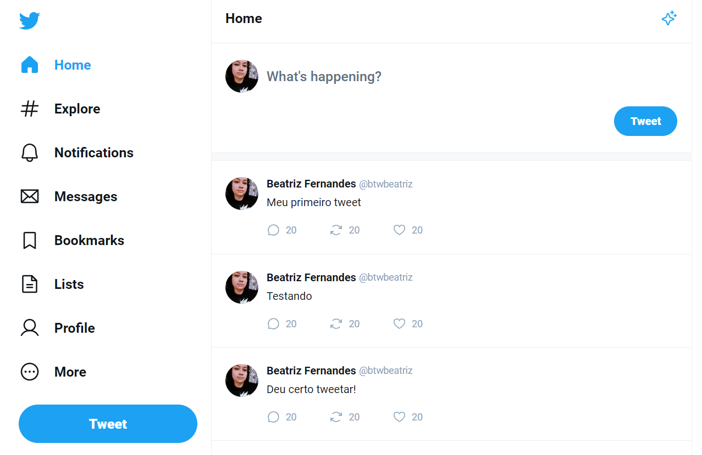

## 👩‍💻 Projeto

Projeto realizado na Masterclass React da Rockeatset. Propóstio era recriar a página home e tweets do Twitter, onde os tweets e são funcionais. É possível tweetar e responder tweets.

## 💻 Tecnologias

Projeto foi desenvolvido com as seguintes tecnologias:

- HTML e CSS
- React (TypeScript)
- Node e NPM
- Vite

  

